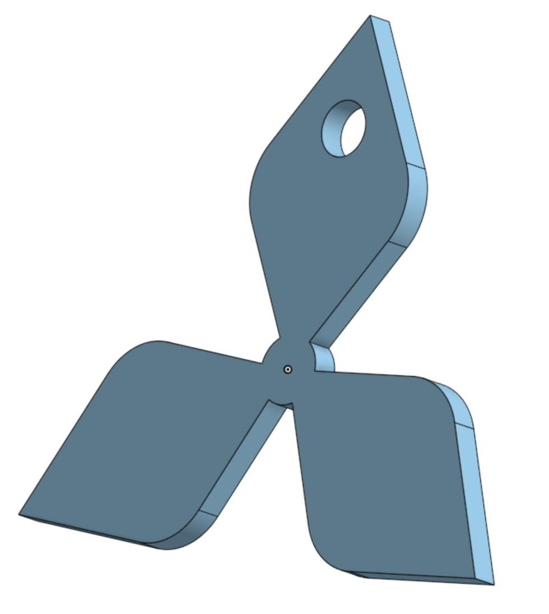
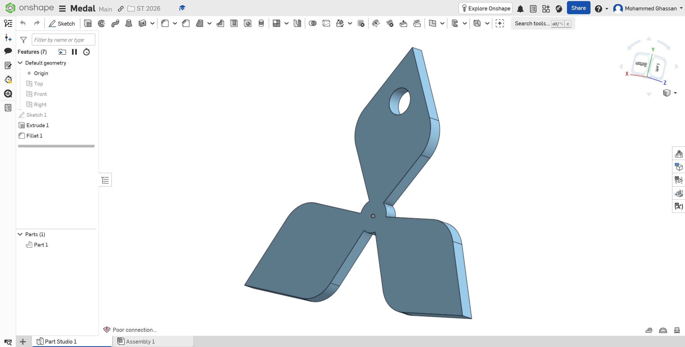

# ST-2026 · Pinwheel Keychain Medal

A small 3-blade pinwheel medal, modeled from scratch in **Onshape** and 3D-printed as a keychain — 2 mm thick with a Ø4 mm keyring hole. Second mechanical task of the Smart Methods (ST 2026) training.

> 🔗 **Onshape design (live):** https://cad.onshape.com/documents/397017cc1a7a12de8732ec00/w/e5a936622b3813b56b62b51a/e/b9a6abfdd1b7551efe16f6b2
> *(open link-sharing on the Onshape document — **Share → Anyone with the link → Can view** — or the link won't open for others)*

---

## 1. Where it started — the inspiration

The task was simple: **pick any image from the internet, estimate its real dimensions by eye, and rebuild it as a printable medal.** The inspiration is the **Mitsubishi three-diamond emblem** — three red rhombi arranged with three-fold symmetry around a common center.

> 🔗 **Reference:** Mitsubishi logo — https://en.wikipedia.org/wiki/Mitsubishi
> *(clean vector recreation of the three-diamond mark — a trademark of Mitsubishi, shown here only to credit the design inspiration)*

I kept that three-fold geometry but reshaped the flat diamonds into **swept, curved blades** and moved one blade to carry the keyring hole — so the medal reads as its own pinwheel/propeller rather than a straight copy of the logo.

---

## 2. The design

Everything is driven from a single flat sketch on the Top plane, then given depth. Because it's a flat medal, all the "engineering" lives in the outline and two numbers: **thickness** and **hole size**.

| Feature | Value | Why |
|---|---|---|
| Overall size | **43.3 × 38.2 mm** | fits comfortably on a keyring / in a palm |
| Thickness (extrude) | **2.0 mm** | required by the task; strong enough not to snap |
| Keyring hole | **Ø4.0 mm** | required by the task; fits a standard split ring |
| Blades | **3 @ 120°** | rotational symmetry keeps it balanced |
| Edges | filleted | softens the print, nicer to hold |

---

## 3. Building it in Onshape

The part is a clean 3-feature history — sketch the profile, give it thickness, soften the edges.

| # | Feature | What it does |
|---|---------|--------------|
| 1 | **Sketch 1** | the pinwheel outline + the Ø4 mm circle for the keyring hole |
| 2 | **Extrude 1** | extrudes the profile **2 mm** into a solid (the hole is cut in the same step) |
| 3 | **Fillet 1** | rounds the edges so the medal isn't sharp |

Result: **Part 1** — one watertight solid body, ready to export.

---

## 4. Engineering & 3D printing

Real figures measured from the exported `Medal.stl`:

| Metric | Value |
|---|---|
| Bounding box | 43.3 × 38.2 × 2.0 mm |
| Solid volume | 1.21 cm³ |
| Surface area | ~1572 mm² |
| Mesh | 652 triangles |
| Est. printed mass — PLA (100% infill) | **~1.5 g** |
| Est. printed mass — PETG | ~1.5 g |
| Est. printed mass — ABS | ~1.3 g |

**Suggested print settings**

| Setting | Value |
|---|---|
| Layer height | 0.16–0.20 mm |
| Walls / top / bottom | enough to be solid at 2 mm (3 walls, ~4 top/bottom layers) |
| Infill | 100% (part is basically all perimeter at this size) |
| Supports | none — it's flat |
| Orientation | lay flat on the bed |

**Honest trade-offs**

- At **2 mm** thick the blades are thin — fine as a keychain charm, but don't lever on them.
- The **Ø4 mm** hole suits a standard split ring; for a larger jump ring, open it up.
- It's a **decorative** part, not load-bearing — no stress analysis was done or needed.

---

## Repository contents

| File / folder | Description |
|---|---|
| [`Medal.stl`](Medal.stl) | the exported mesh (⚠️ exported in **meters** — re-export as **mm** in Onshape, or scale 1000% in your slicer, so it prints at 43 × 38 × 2 mm) |
| [`docs/medal-hero.png`](docs/medal-hero.png) | hero render of the finished medal |
| [`docs/onshape-workspace.png`](docs/onshape-workspace.png) | the Onshape Part Studio (feature tree + model) |
| [`docs/reference.png`](docs/reference.png) | the Mitsubishi three-diamond logo (design inspiration) |
| `README.md` | this file |

**Download:** [`Medal.stl`](Medal.stl) — 43 × 38 × 2 mm, ~32 KB

---

## Key specs

| | |
|---|---|
| Overall | 43.3 × 38.2 × 2.0 mm |
| Hole | Ø4.0 mm |
| Volume | 1.21 cm³ |
| Est. mass (PLA) | ~1.5 g |
| Format | binary STL, 652 triangles |
| Designed in | Onshape |

---

## Credits & references

- **Design:** built from scratch in [Onshape](https://cad.onshape.com/documents/397017cc1a7a12de8732ec00/w/e5a936622b3813b56b62b51a/e/b9a6abfdd1b7551efe16f6b2) by Mohammed Ghassan (@Sniper797).
- **Reference:** Mitsubishi three-diamond logo — https://en.wikipedia.org/wiki/Mitsubishi (a trademark of Mitsubishi; shown only to credit the design inspiration).
- **Task:** Smart Methods — ST 2026 mechanical training, task 2.
